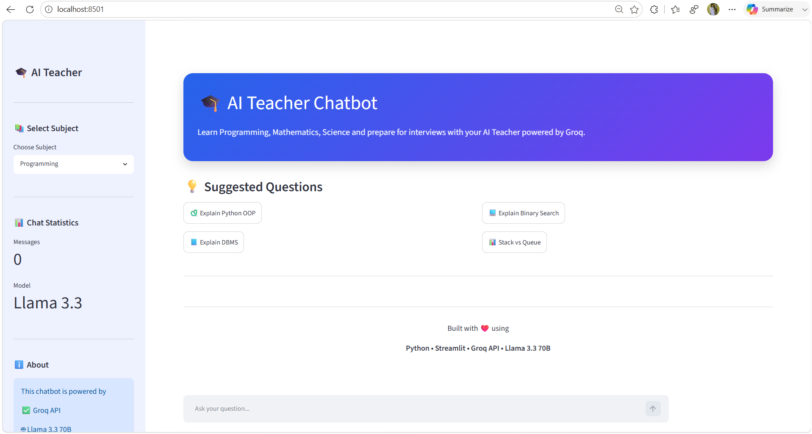
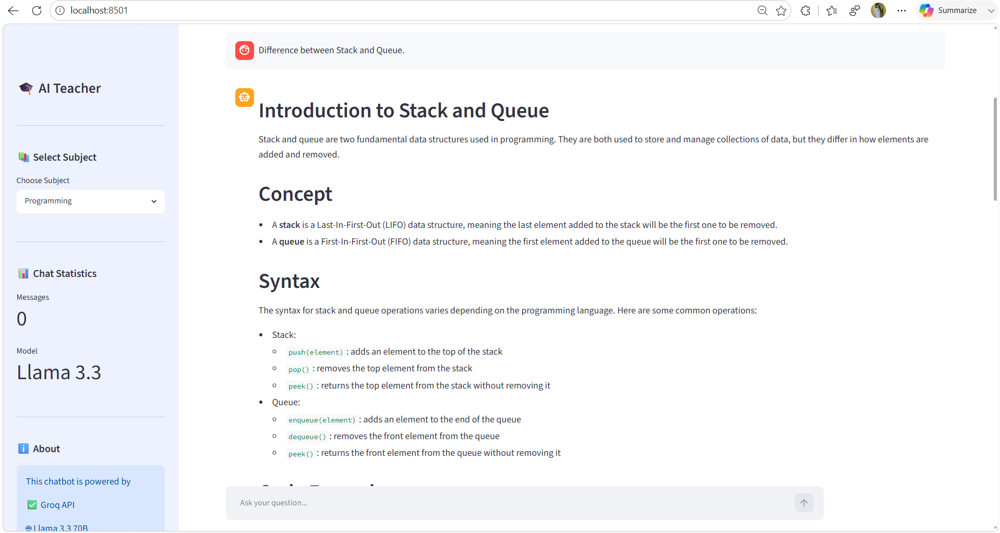
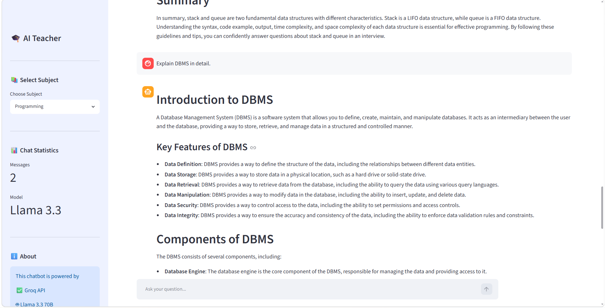

# 🎓 AI Teacher Chatbot

> An AI-powered educational chatbot built with **Python**, **Streamlit**, and the **Groq API (Llama 3.3 70B)** to provide instant, accurate, and interactive learning assistance.

## 🌐 Live Demo

🚀 **Try the AI Teacher Chatbot here:**
🔗 **Live Application:** https://ai-teacher-chatbot-live.streamlit.app/


---

## 📖 Overview

AI Teacher Chatbot is an intelligent learning assistant designed to help students understand concepts, solve programming problems, prepare for interviews, and answer questions across multiple academic subjects.

The chatbot uses the **Groq API** with **Llama 3.3 70B Versatile**, providing fast and high-quality AI responses through a clean and user-friendly Streamlit interface.

---

## ✨ Features

* 🤖 AI-powered conversational chatbot
* 💻 Programming assistance
* 📚 Mathematics support
* 🔬 Science explanations
* 🌍 General knowledge questions
* 🎯 Interview preparation
* ⚡ Lightning-fast responses using Groq API
* 🎨 Modern and responsive Streamlit interface
* 🔐 Secure API key management using `.env`
* 📊 Chat statistics in the sidebar
* 🧹 One-click chat reset

---

## 🛠️ Tech Stack

| Technology    | Purpose                         |
| ------------- | ------------------------------- |
| Python        | Backend Logic                   |
| Streamlit     | Web Interface                   |
| Groq API      | AI Model Access                 |
| Llama 3.3 70B | Large Language Model            |
| python-dotenv | Environment Variable Management |

---

## 📂 Project Structure

```text
AI-Teacher-Chatbot/
│
├── app.py              # Main Streamlit application
├── chatbot.py          # AI response generation
├── config.py           # Environment configuration
├── prompts.py          # Subject-specific prompts
├── styles.py           # Custom UI styling
├── requirements.txt    # Project dependencies
├── .gitignore          # Ignored files
├── .env                # API Key (not uploaded)
└── README.md
```

---

## 🚀 Installation

### 1. Clone the repository

```bash
git clone https://github.com/YOUR_USERNAME/AI-Teacher-Chatbot.git
```

### 2. Navigate into the project

```bash
cd AI-Teacher-Chatbot
```

### 3. Create a virtual environment

```bash
python -m venv venv
```

### 4. Activate the virtual environment

**Windows**

```bash
venv\Scripts\activate
```

**macOS/Linux**

```bash
source venv/bin/activate
```

### 5. Install dependencies

```bash
pip install -r requirements.txt
```

### 6. Create a `.env` file

```env
GROQ_API_KEY=your_groq_api_key
```

### 7. Run the application

```bash
streamlit run app.py
```

The application will open automatically in your browser.

---

## 🎯 Supported Subjects

* 💻 Programming
* 📚 Mathematics
* 🔬 Science
* 🌍 General Knowledge
* 🎯 Interview Preparation

---

## 📸 Screenshots

### 🏠 Home Page



---

### 💬 AI Chat Example 1



---

### 💬 AI Chat Example 2



---

## 🔒 Environment Variables

This project requires a Groq API key.

Create a `.env` file in the project root.

```env
GROQ_API_KEY=your_api_key_here
```

---

## 🤝 Contributing

Contributions, suggestions, and improvements are welcome.

Feel free to fork the repository and submit a pull request.

---

## 📄 License

This project is intended for educational purposes.

---

## 👨‍💻 Author

**Shambhav Kumar**

GitHub: https://github.com/YOUR_USERNAME

LinkedIn: https://linkedin.com/in/YOUR_LINKEDIN

---

⭐ If you found this project helpful, consider giving it a star on GitHub!
